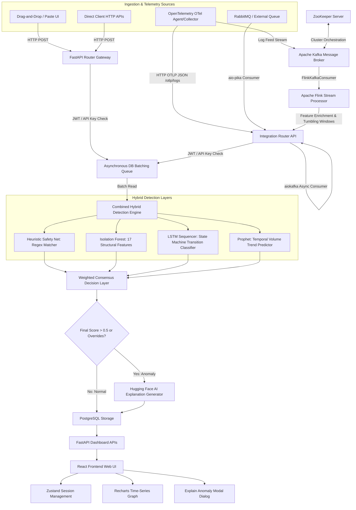

1# BE_Project: Hybrid Log Anomaly Detection System

A production-level hybrid log anomaly detection system combining Heuristics, Isolation Forest, LSTM sequence analysis, and Prophet volume tracking.

## Project Structure

- `/backend`: FastAPI microservice backend using PostgreSQL and Redis.
- `/frontend`: React dashboard (Vite + Tailwind CSS + Recharts).
- `/ML`: Machine Learning training and evaluation scripts (LSTM, Isolation Forest, Prophet).
- `/md`: Thesis documentation and evaluation reports.
- `/files`: Demonstration logs for direct testing.

## Documentation Links

- [Thesis Evaluation Chapter](file:///Users/ayushsakalkale/Desktop/final_be/md/evaluation_chapter.md)
- [Final Metrics Report](file:///Users/ayushsakalkale/Desktop/final_be/md/FINAL_EVALUATION_REPORT.md)
- [Frontend User Guide](file:///Users/ayushsakalkale/Desktop/final_be/md/frontend_instructions.md)

## Prerequisites

Ensure you have the following installed on your system:

- **Docker Desktop** (must be open and running)
- **Python 3.8+** (for running ML evaluation scripts)
- **Node.js (v18+)** (for frontend dashboard)

## Quick Start

1. **Setup Python Virtual Environment** (Recommended for macOS/Linux to avoid permission conflicts):

   ```bash
   python3 -m venv venv
   source venv/bin/activate
   pip install --upgrade pip
   pip install -r ML/requirements.txt
   ```

2. **Configure AI Explanations (Optional)**:
   The backend uses Hugging Face models to explain anomalies. If you wish to use live Hugging Face APIs, rename the `.env.example` in `backend/` to `.env` (or set the environment variable) and add your token:

   ```env
   HUGGINGFACE_API_KEY=your_token_here
   ```

   _(If left empty, the application will automatically fall back to clean local descriptions)._

3. **Launch Services**:

   ```bash
   ./start_project.sh
   ```

4. **Access Web Interfaces**:
   - **Frontend Web UI**: `http://localhost:5173/`
   - **Backend Swagger API Docs**: `http://localhost:8000/docs`

5. **Run the Evaluation Test Suite**:

   ```bash
   ./run_all_tests.sh
   ```

6. **Shutdown and Clean up Services**:
   ```bash
   ./stop_project.sh
   ```

## Troubleshooting & Port Conflicts

- **Port 5432 Conflict (PostgreSQL)**:
  If you have a local PostgreSQL service running on your host machine, the Docker container might fail to start. Stop your local PostgreSQL service before running the startup script:
  - _macOS (Homebrew)_: `brew services stop postgresql`
  - _Linux (systemd)_: `sudo systemctl stop postgresql`
- **Port 5173 Conflict (Vite Frontend)**:
  If port `5173` is already occupied, run `kill -9 $(lsof -t -i:5173)` to free it before running `./start_project.sh`.

---

## System Architecture

Below is the detailed flow diagram of the hybrid log anomaly detection pipeline, from ingestion down to storage and visualization:



## Detailed Technology Stack & Functions

| Component / Layer | Technology | Function in this Project |
| :--- | :--- | :--- |
| **Backend Framework** | **FastAPI (Python)** | Exposes high-performance asynchronous REST endpoints for authentication (`/auth`), ingestion (`/logs`), and stats (`/dashboard`). Generates automated Swagger API documentation. |
| **Database Storage** | **PostgreSQL** | Relational DB for storing user registration records, API keys, ingested log messages, computed anomaly scores, anomaly flags, and natural language AI explanations. |
| **Message Queue & Cache** | **Redis** | In-memory data store acting as the buffer queue for the background batch worker, enabling high-speed parallel log ingestion without database write bottlenecks. |
| **Telemetry Ingestion** | **OpenTelemetry (OTel)** | Provides a standardized protocol (`/otlp/logs` endpoint) to ingest structured JSON logs containing scopes, trace IDs, and span IDs directly from active microservices. |
| **Event Streaming** | **Apache Kafka** | Distributed high-throughput event broker that buffers log telemetry streams (`logs-raw` topic) to isolate the database from rapid spike workloads. |
| **Broker Coordinator** | **ZooKeeper** | Manages cluster states, leader elections, configurations, and topic synchronization for the Apache Kafka broker instances. |
| **Secondary Queue** | **RabbitMQ** | Message broker that integrates with the backend via `aio-pika` to consume external event queues asynchronously. |
| **Stream Processing** | **Apache Flink** | Consumes logs from Kafka via a `FlinkKafkaConsumer`, computes tumbling windows (10-second intervals) to calculate log frequency/error ratios, and streams enriched outputs. |
| **Structural ML** | **Scikit-Learn (Isolation Forest)** | Unsupervised ML model trained on 17 custom feature representations (Shannon entropy, token density, IP/port checks, template similarity) to flag malformed log messages. |
| **Sequence ML** | **TensorFlow / Keras (LSTM)** | Deep learning recurrent neural network trained on block execution transition sequences to identify out-of-order block allocations or skipped replication steps. |
| **Volume ML** | **Facebook Prophet** | Time-series forecasting regression model that flags volume traffic anomalies (spikes and silent periods) by building confidence bands on historic binned log frequency. |
| **Explainable AI** | **Hugging Face API** | Integrates text generation endpoints (e.g., Llama/GPT models) to convert raw exception trace dumps into clear, operator-readable natural language summaries. |
| **Frontend Framework** | **React (Vite)** | Client SPA framework used to compile a reactive user interface with fast reload, responsive layout, and clean dashboard components. |
| **Frontend Styling** | **Tailwind CSS** | Premium dark-mode utility-first styling for cards, sidebars, interactive modals, drag-and-drop file upload regions, and high-density data tables. |
| **State Management** | **Zustand** | Global React state manager that statefully stores logged-in user details, JWT tokens, and handles authentication interceptors for axios requests. |
| **Data Visualization** | **Recharts (D3-based)** | Plotted on the homepage, rendering real-time time-series trends showing anomaly spikes and normal logs over rolling hourly/daily bins. |


