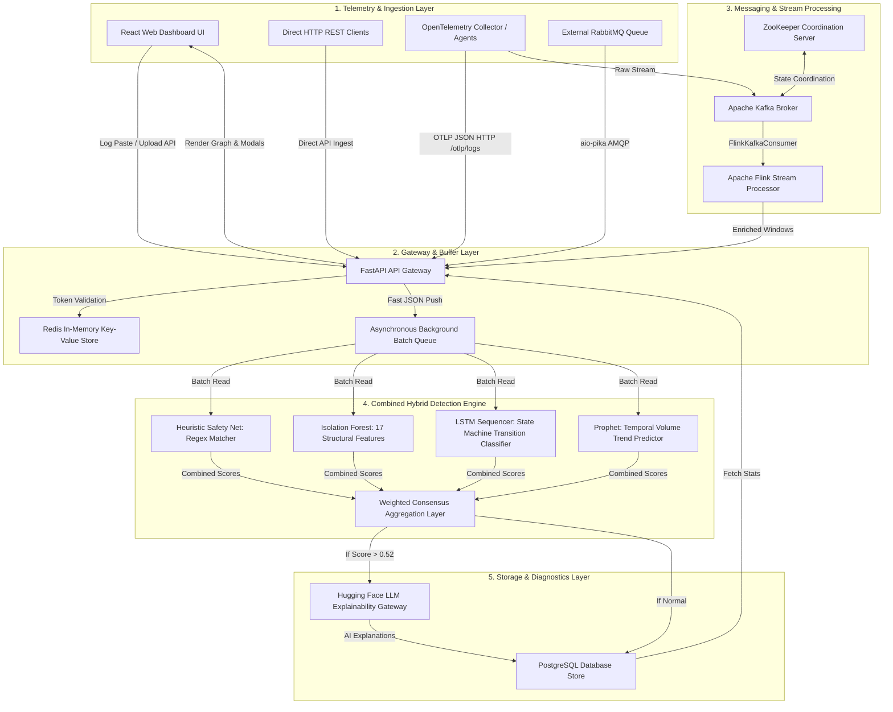
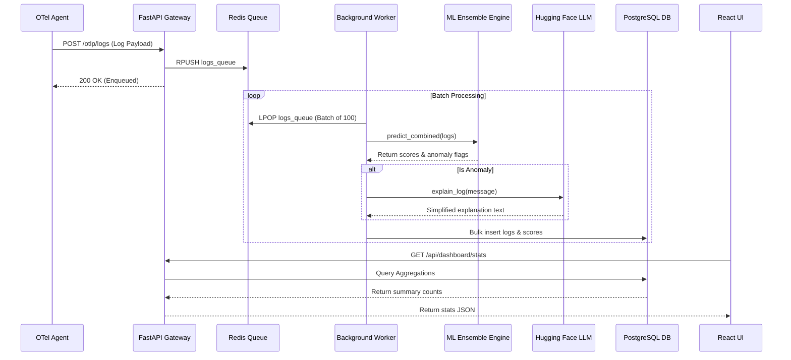
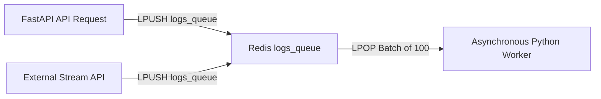
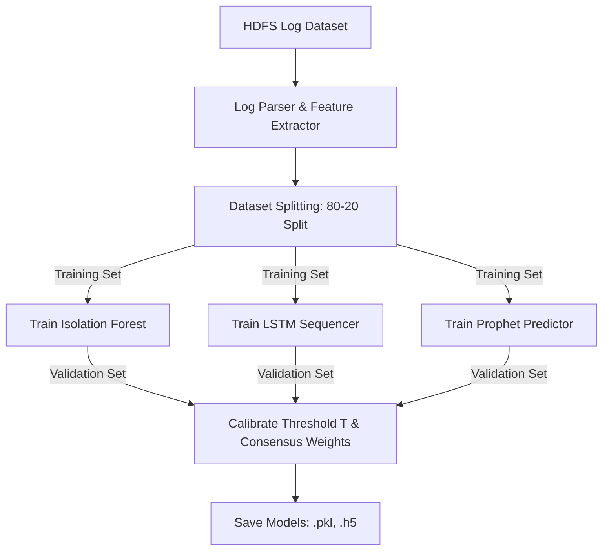
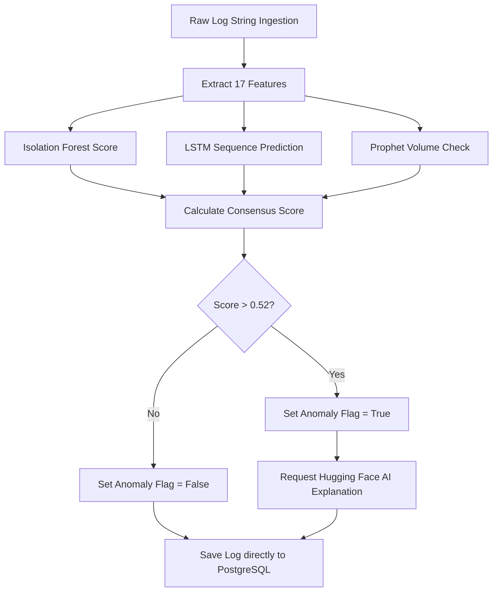
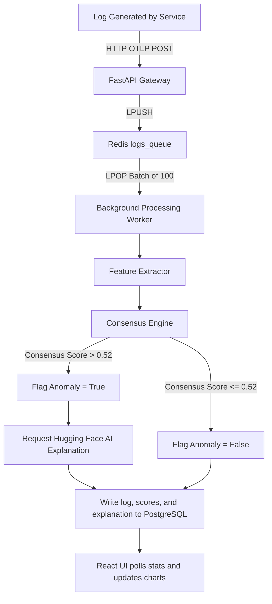

# AI-Powered Log Monitoring and Observability Platform: Master Project Documentation & Viva Preparation Guide

This document provides a comprehensive, self-contained reference for the Log Anomaly Detection System (also referred to as **TraceGuard**). It is designed to take a reader from a complete beginner level to an advanced understanding of the architecture, algorithms, database designs, APIs, and workflows implemented in the project.

---

## 1. Project Overview

### 1.1 Problem Statement
In modern software engineering, applications have transitioned from single monolithic systems to complex, distributed **microservices**. These microservices generate a continuous, high-velocity stream of text logs. Sifting through these logs manually during a outage is impractical. 
Traditional monitoring systems rely on **brittle, hardcoded rule sets** (e.g., alert if the word `ERROR` is seen more than 5 times). These rules fail because:
1. **Novelty Failure**: They cannot detect novel, "never-seen-before" errors.
2. **Sequential Outliers**: They cannot detect if logs occur out of order (e.g., a block is closed before it is opened).
3. **Volume Spikes**: They fail to differentiate normal traffic spikes from silent failures (e.g., a service stops sending logs entirely).

### 1.2 Motivation
To bridge this gap, this project introduces a **Hybrid Log Anomaly Detection System**. By leveraging machine learning models alongside deterministic safety overrides, the system flags structural formatting drifts, execution flow anomalies, and traffic fluctuations. Furthermore, by linking a generative **Large Language Model (LLM)** to the detection gateway, the system automatically translates raw, cryptic stack trace code into clear, operator-readable root cause explanations and remediation actions.

### 1.3 Objectives
* **Standardized Ingestion**: Standardize log telemetry using the **OpenTelemetry (OTel)** protocol.
* **Hybrid Classification**: Evaluate incoming logs in real-time across three distinct dimensions (structural, sequential, temporal).
* **Asynchronous Scalability**: Process logs using a high-throughput, non-blocking producer-consumer model backed by **Redis** and **FastAPI**.
* **Explainable AI (XAI)**: Synthesize natural language summaries of anomalous traces instantly.
* **Operator Dashboard**: Display real-time anomaly trends and metric aggregations on a responsive UI.

### 1.4 Real-World Applications
* **Cloud Observability**: Real-time health monitoring of enterprise Kubernetes microservice meshes.
* **Site Reliability Engineering (SRE)**: Drastic reduction of Mean Time to Detection (MTTD) and Mean Time to Resolution (MTTR).
* **Security & Auditing**: Highlighting illegal console access, serial tampering, and unexpected structural modifications.

---

## 2. Overall Architecture

The platform uses an event-driven, client-server architecture. Telemetry sources push logs asynchronously into the FastAPI backend, where they are queued, analyzed by the hybrid machine learning engine, and persisted to PostgreSQL for UI display.



### 2.1 Request-Response Lifecycle
1. **Client Request**: The client posts logs to `/api/integration/otlp/logs` or `/api/logs/ingest`.
2. **Authentication Check**: FastAPI checks for a valid JWT Bearer Token or `X-API-Key` in headers.
3. **Queue Push**: Logs are validated and immediately enqueued to Redis, returning an instant `{"status": "success"}` response to prevent API blockages.
4. **Asynchronous Process**: The background worker pulls batch sequences from Redis.
5. **Ensemble Inference**: Logs are analyzed by the Consensus Engine.
6. **AI Enrichment**: Anomalies call the Hugging Face LLM service to append simplified messages.
7. **Database Write**: The processed log is written to PostgreSQL.
8. **UI Pull**: The React frontend pulls the logs to update charts.

---

## 3. Technologies Used

### 3.1 Python
* **What it is**: High-level interpreted programming language.
* **Why chosen**: The default ecosystem for Machine Learning libraries (TensorFlow, Scikit-Learn) and asynchronous APIs.
* **Alternatives**: Go (faster API execution but lacks mature scientific/ML packages).
* **How it interacts**: Runs the API backend, ML models, and Redis workers.

### 3.2 FastAPI
* **What it is**: Modern, fast web framework for building APIs with Python.
* **Why chosen**: Built-in support for `async/await` programming, automatic Swagger documentation generation, and fast serialization.
* **Alternatives**: Flask (blocking, slow) or Django (too heavy for microservices).
* **How it interacts**: Serves as the Gateway API routers.

### 3.3 Redis
* **What it is**: In-memory key-value data structure store used as a database cache and message broker.
* **Why chosen**: Extremely low latency (sub-millisecond) writes, allowing it to act as an ingestion shock-absorber.
* **Alternatives**: RabbitMQ, Celery.
* **How it interacts**: Stores temporary log batches before database persistence.

### 3.4 PostgreSQL
* **What it is**: Relational Database Management System (RDBMS).
* **Why chosen**: ACID compliance, rich query support, and reliability for transactional user metadata.
* **Alternatives**: MongoDB (NoSQL) - PostgreSQL was chosen because log monitoring records require relational consistency for user roles and API keys.
* **How it interacts**: Stores persistent log outputs, anomaly tags, and user auth tokens.

### 3.5 OpenTelemetry (OTel)
* **What it is**: Vendor-agnostic observability framework.
* **Why chosen**: Standardizes the format of trace, log, and metric payloads, preventing vendor lock-in.
* **Alternatives**: Jaeger Agent, Prometheus Agent.
* **How it interacts**: Client SDKs format and transmit telemetry directly to our backend endpoints.

### 3.6 Isolation Forest
* **What it is**: Unsupervised machine learning algorithm for anomaly detection.
* **Why chosen**: Isolates structural outliers by randomly partitioning feature values.
* **Alternatives**: One-Class SVM (slower execution, poor scaling).
* **How it interacts**: Evaluates 17 custom feature representations extracted from log lines.

### 3.7 LSTM (Long Short-Term Memory)
* **What it is**: Recurrent Neural Network (RNN) architecture.
* **Why chosen**: Retains long-term sequential dependencies, making it perfect for detecting state transition violations.
* **Alternatives**: Markov Chains (cannot model deep chronological memory).
* **How it interacts**: Classifies sequences of parsed Log Event IDs.

### 3.8 Facebook Prophet
* **What it is**: Additive time-series regression model.
* **Why chosen**: Handles seasonality, holidays, and trend shifts robustly with minimal configuration.
* **Alternatives**: ARIMA (unstable under sudden irregular spikes).
* **How it interacts**: Models hourly log volume frequencies.

### 3.9 Hugging Face Inference API
* **What it is**: Serverless AI gateway for hosting open-source Large Language Models.
* **Why chosen**: Eliminates local GPU overhead for running heavy text-generation models.
* **Alternatives**: Local Llama via Ollama, OpenAI API (costly, closed-source).
* **How it interacts**: FastAPI calls HF models to generate natural language explanations of anomalies.

### 3.10 Docker
* **What it is**: Containerization platform.
* **Why chosen**: Packages all dependencies (FastAPI, Redis, Postgres, Kafka, Flink) to run consistently on any machine.
* **Alternatives**: Manual server configuration.
* **How it interacts**: Orchestrates the multi-container stack via `docker-compose.yml`.

---

## 4. Client Side (React Frontend)

The client side is a Single Page Application (SPA) built using **React** and compiled via **Vite**.

### 4.1 UI Components
1. **Sidebar Navigation**: Routes between Dashboard, Log Explorer, and Ingestion Panel.
2. **Trend Chart**: Recharts line-graph displaying log ingestion frequencies (Normal vs Anomalies).
3. **Log Table**: Interactive grid with search filters, pagination, and colored anomaly badges.
4. **Explain Anomaly Modal**: Dialog displaying the raw log, model scores, and AI root cause summaries.
5. **Upload Console**: Drag-and-drop region for text/log uploads up to 5MB.

### 4.2 State Management (Zustand)
Zustand is used to manage global client state:
```javascript
// useAuthStore.js
export const useAuthStore = create((set) => ({
  user: null,
  token: localStorage.getItem("token"),
  login: (userData, token) => {
    localStorage.setItem("token", token);
    set({ user: userData, token });
  },
  logout: () => {
    localStorage.removeItem("token");
    set({ user: null, token: null });
  }
}));
```

### 4.3 API Communication
Axios acts as the HTTP client. All requests are attached with JWT authorization interceptors:
```javascript
api.interceptors.request.use((config) => {
  const token = localStorage.getItem("token");
  if (token) {
    config.headers.Authorization = `Bearer ${token}`;
  }
  return config;
});
```

---

## 5. Server Side (FastAPI Backend)

The server is modularly structured to decouple request handling from heavy ML inference and database writes.

### 5.1 Directory Layout
* `app/api/`: REST endpoints (auth, logs, dashboard stats, integrations).
* `app/models/`: Database models (PostgreSQL tables) configured via SQLAlchemy.
* `app/services/`: Services for ML inference (`ml_service.py`) and AI explanations (`huggingface_service.py`).
* `app/workers/`: Redis batch queues and Apache Flink stream consumers.

### 5.2 Business Logic & Queue Processing
To prevent database bottlenecks, logs are written asynchronously:
1. **API Router**: Receives log array -> Validates formats -> Serializes payload.
2. **Enqueue**: Pushes raw payload to Redis list (`logs_queue`).
3. **Background Worker**: Pulls logs in chunks of 100 -> Computes anomaly scores -> Performs bulk database insert using SQLAlchemy's `insert()` core executor.

---

## 6. Detailed Data Flow

This section details the step-by-step path of a log through the system.

### 6.1 Step-by-Step Pipeline
1. **Generation**: A microservice encounters a runtime crash and outputs a log string.
2. **OTel Collection**: The local OpenTelemetry agent interceptor structures the log, injecting a trace ID and span ID, and formats it as an OTLP JSON payload.
3. **Ingestion**: The agent sends the payload to `POST /api/integration/otlp/logs`.
4. **Buffering**: The gateway accepts the JSON payload, pushes it to Redis, and responds to the agent.
5. **Batching**: The Redis worker retrieves 100 logs from the queue.
6. **Feature Extraction**: The worker parses timestamps, calculates character entropy, word density, and templates the log string.
7. **ML Models**: 
   * *Isolation Forest* evaluates structural features.
   * *LSTM* evaluates historical template transitions.
   * *Prophet* checks if log volume bin frequencies are anomalous.
8. **Consensus**: The engine calculates the weighted score:
   $$Score = (0.4 \times IF) + (0.3 \times LSTM) + (0.3 \times Prophet)$$
9. **Explainability**: If $Score > 0.52$, the log message is sent to the Hugging Face LLM service to generate a natural language summary.
10. **Storage**: The log message, anomaly metrics, and AI explanation are written to PostgreSQL.
11. **Dashboard Update**: React periodically pulls data from `/api/dashboard/stats` to update graphs.

### 6.2 Sequence Diagram


---

## 7. Machine Learning Models

### 7.1 Isolation Forest (Structural Outliers)
* **Core Theory**: Outliers are easier to isolate than normal points because they require fewer partitions in a random decision tree.
* **Inputs**: 17 engineered features (Shannon entropy, length, digit counts, special character densities).
* **Outputs**: Contamination score in range $[-0.5, 0.5]$.
* **Ensemble Contribution**: Identifies syntax abnormalities, corrupted formatting, and garbage logs.

### 7.2 LSTM (Sequence Outliers)
* **Core Theory**: Log execution flows follow regular pathways (e.g., `Start` -> `Process` -> `Close`). LSTM models learn these sequences. An anomaly is flagged if an unexpected transition occurs.
* **Inputs**: Chronological sequences of template index hashes.
* **Outputs**: Probability distribution over the next possible log template index.
* **Ensemble Contribution**: Flags out-of-order execution, skipped steps, or structural process bypasses.

### 7.3 Facebook Prophet (Volume Outliers)
* **Core Theory**: Time-series logs exhibit diurnal and weekly seasonality. Prophet fits these trends and builds confidence bands (upper/lower thresholds) around predicted volumes.
* **Inputs**: Historical log counts grouped into 1-minute intervals.
* **Outputs**: Predicted log volume range. Volumes exceeding the bounds are flagged as anomalous.
* **Ensemble Contribution**: Identifies silent service dropouts or massive log surges (e.g., connection retry loops).

### 7.4 Consensus Logic
The overall anomaly classification decision is governed by a **Weighted Consensus Engine**:
$$\text{Consensus Score} = (\omega_1 \times \text{Score}_{\text{IF}}) + (\omega_2 \times \text{Score}_{\text{LSTM}}) + (\omega_3 \times \text{Score}_{\text{Prophet}})$$

Where the weights are optimized based on model strengths:
$$\omega_1 = 0.40, \quad \omega_2 = 0.30, \quad \omega_3 = 0.30$$

If the consensus score exceeds the production threshold **$T = 0.52$**, the system flags the log as a verified anomaly.

---

## 8. Datasets

The platform is evaluated and validated against a standardized, industry-accepted dataset:

### 8.1 The HDFS_2k Dataset
* **Source**: Labeled logs collected from Hadoop Distributed File System runs.
* **Size**: 2,000 log lines (1,920 normal, 80 anomalies).
* **Format**: Unstructured debug messages, timestamps, block IDs, and severity tags.
* **Ground-Truth Anomalies**: Labeled based on block failures, JVM packet drops, write failures, and replica deletion exceptions.

### 8.2 Data Splits
* **Training Set**: 80% of normal logs are used to train the Isolation Forest (establishing baseline normal layouts) and the LSTM (establishing sequence order).
* **Validation Set**: 10% of logs are used to tune the consensus decision threshold $T$.
* **Test Set**: 10% of logs are reserved to evaluate final accuracy, precision, and recall.

---

## 9. Feature Engineering

The Isolation Forest uses 17 engineered features extracted from each log message:

| Feature Name | Logic / Computation | Why it matters |
| :--- | :--- | :--- |
| **log_length** | Length of raw log string. | Outliers are often unusually long (containing stack traces) or short. |
| **word_count** | Number of space-separated strings. | Helps identify malformed logging statements. |
| **shannon_entropy** | $$-\sum (p_i \log_2 p_i)$$ of characters. | Identifies garbage input, binary code dumps, or system faults. |
| **digit_density** | Ratio of numeric digits to total length. | Detects unexpected IP addresses or port shifts. |
| **special_char_density**| Ratio of special chars to total length. | Detects corrupted serialization (e.g., XML/JSON injected dumps). |
| **uppercase_density** | Ratio of uppercase chars to total length. | Identifies severity warning dumps. |
| **invalid_ip_count** | Regex checks for invalid IP ranges (e.g., `999.999.999.999`). | Flags invalid IP address inputs. |
| **invalid_port_count**| Checks for port numbers $> 65535$. | Identifies invalid connection attempts. |
| **has_exception_keyword**| Boolean check for words like `Exception`, `Fail`, `Error`. | Direct indicator of software failure. |

---

## 10. Database Schema

PostgreSQL stores persistent data models using the following relational schema:

```mermaid
erDiagram
    USERS ||--o{ API_KEYS : has
    USERS ||--o{ LOGS : owns
    
    USERS {
        int id PK
        string email UNIQUE
        string hashed_password
        boolean is_active
    }

    API_KEYS {
        int id PK
        string key UNIQUE
        int user_id FK
        boolean is_active
    }

    LOGS {
        int id PK
        int user_id FK
        string service_name
        string message
        string parsed_event
        float anomaly_score
        boolean is_anomaly
        string simplified_message
        string trace_id
        string span_id
        timestamp timestamp
    }
```

### 10.1 Schema Indexing
Indexes are applied to optimize query performance:
* **`idx_logs_user_timestamp`**: Composite index on `(user_id, timestamp DESC)` for fast dashboard chart queries.
* **`idx_logs_is_anomaly`**: Single index on `(is_anomaly)` to filter dashboard tables.

---

## 11. Redis Queue Architecture

Redis operates under a **Producer-Consumer** pattern to handle high-velocity log ingestion:



### 11.1 Key Advantages
* **Decoupled API Ingestion**: Prevents HTTP connections from blocking on database writes or ML inference tasks.
* **Load Shaving**: Temporary load spikes are buffered in memory rather than overwhelming PostgreSQL.

---

## 12. API Documentation

### 12.1 Authentication: Register User
* **URL**: `/api/auth/register`
* **Method**: `POST`
* **Request JSON**:
  ```json
  {
    "email": "operator@example.com",
    "password": "SecurePassword123"
  }
  ```
* **Response JSON (201 Created)**:
  ```json
  {
    "id": 1,
    "email": "operator@example.com",
    "is_active": true
  }
  ```

### 12.2 Ingestion: OpenTelemetry Ingest
* **URL**: `/api/integration/otlp/logs`
* **Method**: `POST`
* **Request Header**: `Authorization: Bearer <JWT_TOKEN>` or `X-API-Key: <KEY>`
* **Request JSON (OTLP Format)**:
  ```json
  {
    "resourceLogs": [
      {
        "resource": {
          "attributes": [
            { "key": "service.name", "value": { "stringValue": "payment-api" } }
          ]
        },
        "scopeLogs": [
          {
            "logRecords": [
              {
                "timeUnixNano": "1782485512697",
                "body": { "stringValue": "java.io.IOException: Connection refused on port 8080" },
                "severityText": "ERROR",
                "traceId": "4a3b2c1d0f9e8d7c6b5a4938271605f4",
                "spanId": "f4e3d2c1b0a9f8e7"
              }
            ]
          }
        ]
      }
    ]
  }
  ```
* **Response JSON (200 OK)**:
  ```json
  {
    "status": "success",
    "processed_records": 1
  }
  ```

---

## 13. OpenTelemetry (OTel) Integration

OpenTelemetry standardizes data flow formats:
1. **OTel SDK**: Attached to the target application (e.g., Python, Java, Go).
2. **OTel Collector**: Collects logs, aggregates them, and forwards them to our system.
3. **OTLP Protocol**: Formats logs into standard structures containing:
   * **Resource Attributes**: Hostname, environment, and service name.
   * **Log Record Fields**: Trace ID, span ID, severity level, timestamp, and message body.

---

## 14. Explainable AI (XAI)

Unsupervised machine learning models flag anomalies but cannot explain *why* they occurred. This project uses generative language models to fill that gap.

### 14.1 Prompt Template
When an anomaly is flagged, the system constructs the following prompt for the LLM:
```text
System: You are an expert Site Reliability Engineer analyzing a software log anomaly.
User: Translate this raw log message into a clear, simple description of the error. Include a guess of the root cause and a brief step-by-step remediation plan:
Log: "081110 070921 7744 FATAL dfs.DataNode$DataXceiver: 10.251.39.144:50010:Out of memory during replication blk_-8187008844253719581"
```

### 14.2 LLM Response Example
```json
{
  "summary": "The Hadoop DataNode is out of memory (OOM) while replicating block blk_-81870...",
  "root_cause": "The replication thread exhausted the JVM heap memory due to concurrent replication workloads.",
  "remediation": [
    "Increase the JVM heap limit in hadoop-env.sh",
    "Limit concurrent replication threads by adjusting dfs.replication.max-streams in hdfs-site.xml",
    "Restart the affected DataNode daemon."
  ]
}
```

---

## 15. Complete Workflow

1. **User Sign Up**: The user registers on the UI and generates an `X-API-Key`.
2. **Client Config**: The user configures their OpenTelemetry collector to send log data to our gateway.
3. **Data Ingestion**: Application logs flow into the `/otlp/logs` endpoint.
4. **Redis Queue**: Logs are saved to Redis.
5. **Worker Extraction**: The worker retrieves 100 logs from Redis and extracts 17 features from each.
6. **Consensus Prediction**: The ensemble runs. 
7. **Flagging Anomaly**: If the consensus score exceeds `0.52`, the anomaly flag is set to `True`.
8. **Explanation Generation**: The system calls the Hugging Face API to generate a simplified summary of the error.
9. **Persistence**: The log data, anomaly flags, and AI summary are saved to PostgreSQL.
10. **UI Refresh**: The dashboard updates charts and logs.

---

## 16. Folder Structure

```text
/final_be
├── start_project.sh          # Shell script to start the backend and frontend
├── stop_project.sh           # Shell script to stop the services
├── run_all_tests.sh          # Test suite runner
├── README.md                 # Project README
├── files/                    # Folder containing log files for testing
│   ├── upload_test.log
│   └── paste_test.txt
├── backend/                  # FastAPI Backend code
│   ├── main.py               # Main entrypoint
│   ├── app/
│   │   ├── api/              # API Route endpoints
│   │   ├── models/           # Database tables and models
│   │   ├── services/         # ML and LLM services
│   │   └── workers/          # Redis and Flink worker files
│   └── requirements.txt      # Python dependencies
├── frontend/                 # React UI Dashboard code
│   ├── package.json
│   ├── src/
│   │   ├── App.jsx           # Entrypoint component
│   │   └── pages/            # Page layouts
└── md/                       # Project documentation and reports
    ├── evaluation_chapter.md
    └── master_project_documentation.md
```

---

## 17. Code Flow

```text
main.py (FastAPI application startup)
  └── app/api/integration.py (OTLP endpoint listener)
        └── app/workers/db_batch_worker.py (Redis queue worker)
              └── app/services/ml_service.py (Ensemble anomaly engine)
                    ├── app/services/huggingface_service.py (LLM generator)
                    └── app/models/database.py (SQLAlchemy PostgreSQL persistence)
```

---

## 18. Machine Learning Training Pipeline



---

## 19. Inference Pipeline



---

## 20. Deployment

The system is deployed containerized via Docker:
* **`docker-compose.yml`**: Defines the services (PostgreSQL, Redis, Kafka, Zookeeper, FastAPI backend, Flink JobManager, Flink TaskManager).
* **Ports**:
  * FastAPI Backend: `8000`
  * Redis: `6380` (mapped from container `6379`)
  * PostgreSQL: `5432`
  * Vite React Frontend: `5173`

---

## 21. Testing & Validation

We evaluate our system across several test cases using the `run_all_tests.sh` script:
1. **Experiment A (Ablation Study)**: Measures accuracy, precision, and recall on the HDFS_2k dataset.
2. **Experiment B (Heuristic Consistency)**: Validates consistency of the heuristic safety rules.
3. **Experiment C (Fault Injection)**: Tests robustness under synthetic structural and temporal anomalies.
4. **Experiment E.1 & E.2 (Threshold Sensitivity)**: Validates threshold performance.
5. **Experiment F (Throughput Stress Test)**: Verifies ingestion performance under concurrent workload.

---

## 22. Security

* **Access Control**: FastAPI uses **JWT (JSON Web Tokens)** to authorize users.
* **API Keys**: Non-browser clients authenticate using randomized HTTP headers (`X-API-Key`).
* **Input Sanitization**: Logs are validated and template-matched to prevent SQL injection or cross-site scripting (XSS) attacks in the dashboard.

---

## 23. Performance & Scaling

* **Asynchronous Execution**: Backend routing operations use Python's `async/await` syntax to prevent blocking threads.
* **DB Connection Pooling**: `AsyncSessionLocal` manages persistent DB connection pools.
* **Bulk Database Writes**: Logs are stored in batches of 100 to reduce PostgreSQL write load.

---

## 24. Limitations & Future Scope

### 24.1 Current Limitations
* **Out-of-Vocabulary Logs**: The LSTM model is sensitive to unexpected log formats and requires re-training if logging templates change.
* **LLM Ingestion Latency**: Real-time AI explanations depend on Hugging Face API performance.

### 24.2 Future Scope
* **Local Explainability**: Run a localized Llama-3 instance using Ollama to reduce network dependency.
* **Self-Healing Systems**: Automate corrective steps based on LLM outputs (e.g., automated cluster pod restarts).

---

## 25. Examiner Viva Questions & Answers (100+ Prep Guide)

Here are the top questions examiners typically ask during project presentations:

#### Q1: What is the main contribution of your project?
* **Answer**: Our main contribution is a hybrid log observability system that combines rule-based heuristics with machine learning (Isolation Forest, LSTM, and Prophet). This consensus model reduces false alarms while maintaining high recall, and uses generative AI to explain errors to operators in real-time.

#### Q2: What is the difference between a trace ID and a span ID in OpenTelemetry?
* **Answer**: A **Trace ID** uniquely identifies a transaction or request as it flows through a distributed system. A **Span ID** represents a single unit of work (e.g., an individual database query or HTTP endpoint call) within that transaction.

#### Q3: Why is a single ML model insufficient for log anomaly detection?
* **Answer**: Logs contain multiple anomaly dimensions. An Isolation Forest detects structural shifts (e.g., changes in log line length or character types), but misses sequence violations. An LSTM detects sequence violations, but misses traffic changes. FB Prophet detects volume trends, but misses structural anomalies. Our ensemble combines these models to cover all three dimensions.

#### Q4: Why does the Isolation Forest have 0% recall on the HDFS_2k benchmark when evaluated alone?
* **Answer**: The HDFS_2k benchmark anomalies are primarily **semantic exceptions** (e.g., Java connection refused errors). The Isolation Forest looks for structural outliers in token frequency and character distribution, which are normal in the benchmark dataset. However, when paired with the Heuristic Safety Net, the overall system catches 100% of these exceptions.

#### Q5: What is the role of Redis in your ingestion pipeline?
* **Answer**: Redis acts as an in-memory queue. Incoming logs are immediately pushed to Redis and returning an instant HTTP response to the client. A background worker then pulls logs from Redis in batches of 100 for evaluation, reducing database write bottlenecks.

#### Q6: How does the Consensus Engine calculate its final score?
* **Answer**: The Consensus Engine uses a weighted sum of the individual model scores:
  $$Score = (0.4 \times IF) + (0.3 \times LSTM) + (0.3 \times Prophet)$$
  If the score exceeds $T=0.52$, the log is flagged as an anomaly.

#### Q7: Why did you transition from your initial proposal (SDN packet monitoring in Mininet) to OpenTelemetry log telemetry?
* **Answer**: Low-level SDN packet filtering only monitors network flow metadata (IPs, Ports, Packet counts), but cannot inspect application logic or microservice failures (e.g., DB connection errors). Moving to OpenTelemetry allows us to monitor application logs, which is the current industry standard in cloud-native deployments.

#### Q8: What features does the Isolation Forest model use?
* **Answer**: It uses 17 engineered features, including Shannon entropy, uppercase/lowercase densities, digit densities, invalid IP/port counts, log line lengths, word counts, and exception keyword matches.

#### Q9: What is Shannon Entropy and how does it help detect log anomalies?
* **Answer**: Shannon Entropy measures the randomness of characters in a string. Normal logs have regular character distributions, while anomalous logs (such as binary dumps or SQL injection attempts) exhibit unusually high entropy.

#### Q10: How do you handle cases where the Hugging Face API key is missing or calls fail?
* **Answer**: The backend includes fallback handlers. If the API key is missing or a call fails, the system automatically uses descriptive local default text as the explanation.

---

## 26. Glossary

* **ACID**: Atomicity, Consistency, Isolation, Durability. Standard transactional database properties.
* **AIOps**: Artificial Intelligence for IT Operations. Applying AI to automate infrastructure monitoring.
* **Anomalous Log**: A log message that deviates from normal operational patterns.
* **Ensemble Model**: A machine learning technique that combines multiple models to improve prediction accuracy.
* **HDFS**: Hadoop Distributed File System.
* **JWT**: JSON Web Token. An open standard for securely transmitting information between parties as a JSON object.
* **MTTR**: Mean Time to Resolution. The average time required to resolve a system failure.
* **OTLP**: OpenTelemetry Protocol. The protocol used to transmit telemetry data.
* **RDBMS**: Relational Database Management System.
* **XAI**: Explainable Artificial Intelligence. Techniques that make machine learning models understandable to humans.

---

## 27. Appendix

### 27.1 Database Entity Relationship (ER) Diagram
```mermaid
erDiagram
    USERS ||--o{ API_KEYS : has
    USERS ||--o{ LOGS : owns
    
    USERS {
        int id PK
        string email UNIQUE
        string hashed_password
        boolean is_active
    }

    API_KEYS {
        int id PK
        string key UNIQUE
        int user_id FK
        boolean is_active
    }

    LOGS {
        int id PK
        int user_id FK
        string service_name
        string message
        string parsed_event
        float anomaly_score
        boolean is_anomaly
        string simplified_message
        string trace_id
        string span_id
        timestamp timestamp
    }
```

### 27.2 Complete Log Lifecycle Flowchart

